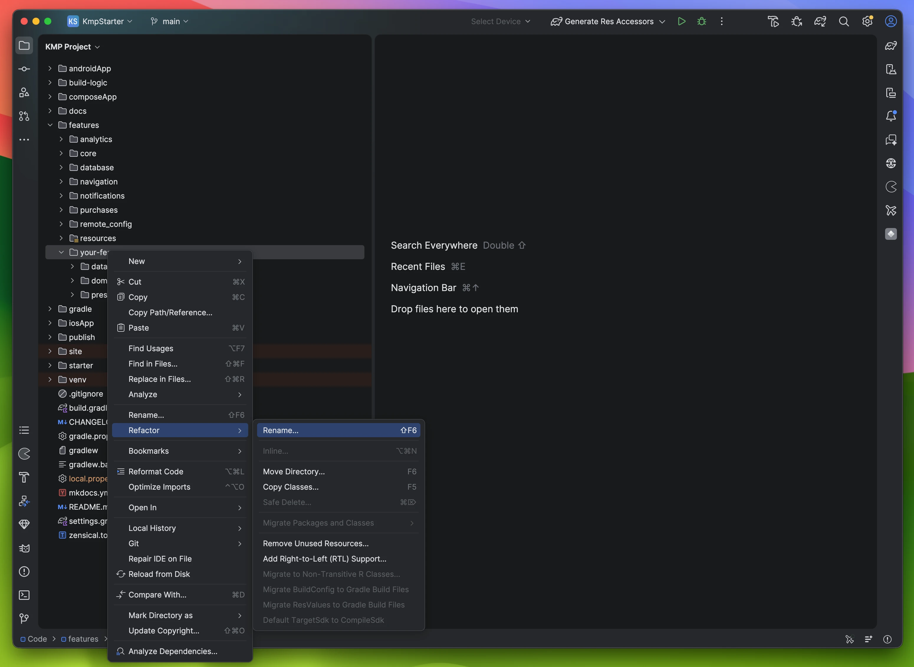
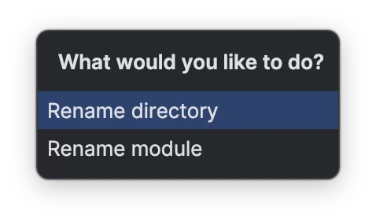
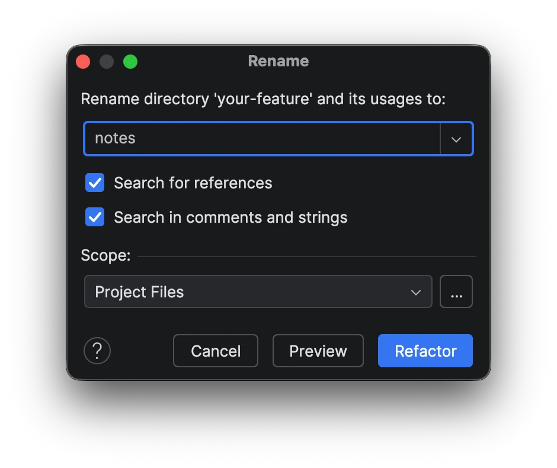
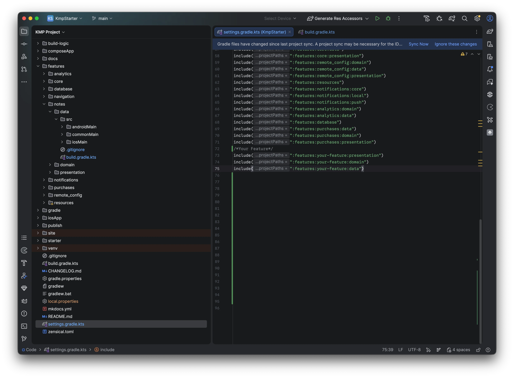
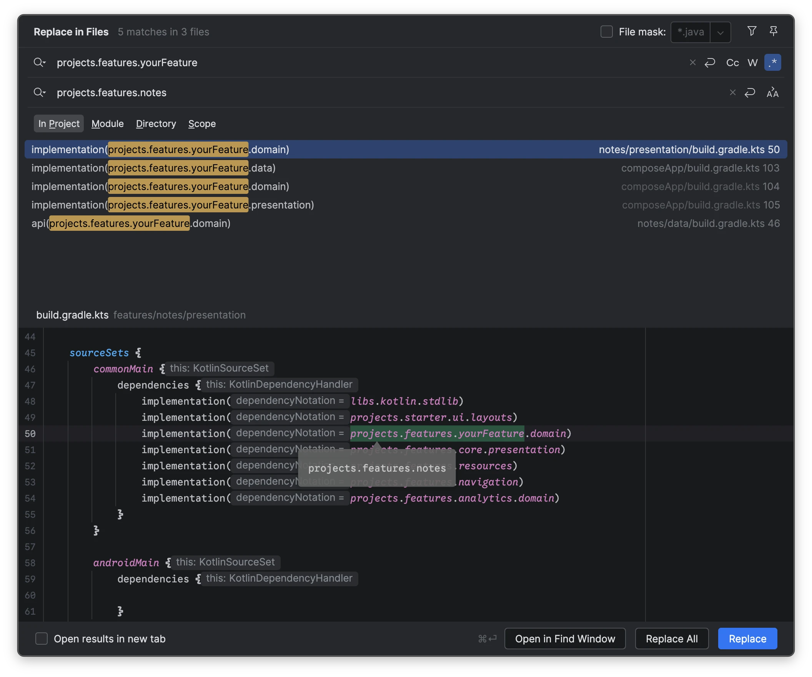
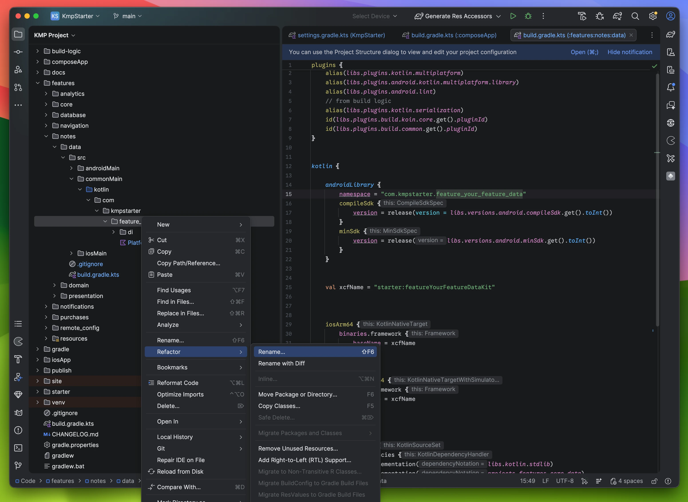
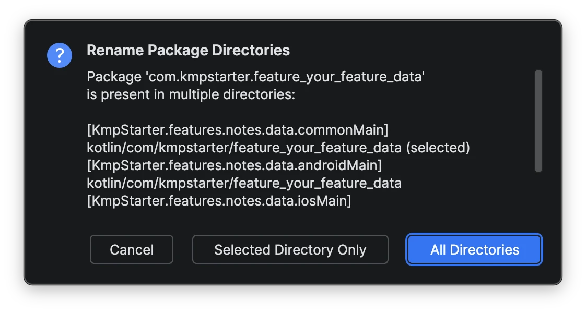
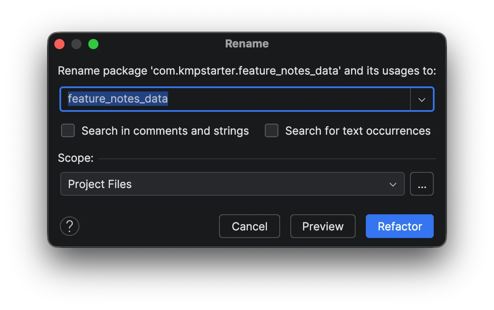
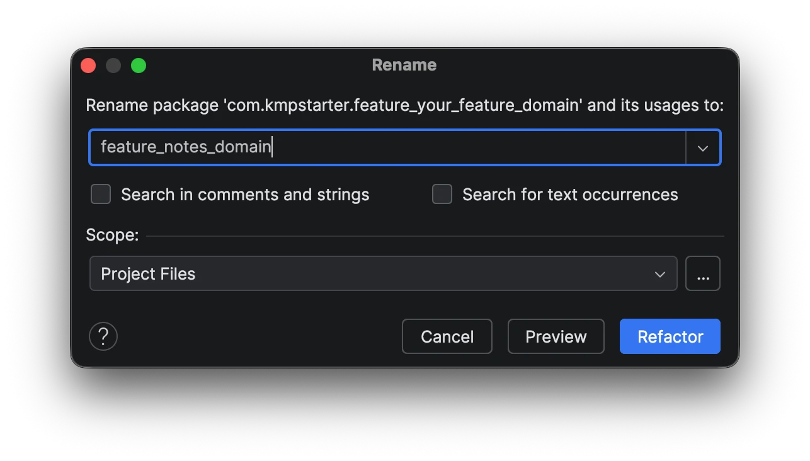
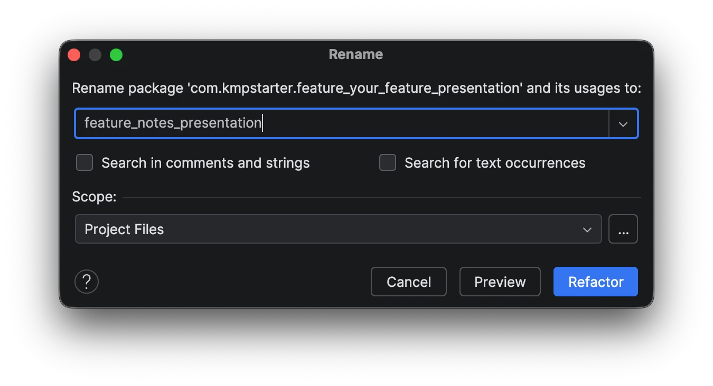

# Writing Your Own Code

Starter Template is project-agnostic. It does not care what app you are building — it simply provides a clean and scalable structure so you can start building immediately.

Since the template follows **Clean Architecture**, each feature is divided into:

* `data`
* `domain`
* `presentation`

If you are building a **Notes app**, you can convert `your-feature` into a `notes` feature and start implementing your logic.

---

## Feature Structure

You will find the placeholder module inside:

```
features/your-feature/
```

It contains:

```
data/
domain/
presentation/
```

Rename this module to match your feature and begin development.

---

## Refactoring (Recommended)

It is strongly recommended to properly rename `your-feature`.
The placeholder name has no meaning and should be replaced.

---

### Step 0 – Rename Module

Right-click on `your-feature`
→ `Refactor`
→ `Rename`



---

### Step 1 – Rename Directory

Select **Rename Directory**



---

### Step 2 – Enter Feature Name

Enter your feature name.

Example: `notes`



---

### Step 3 – Update settings.gradle.kts

Open `settings.gradle.kts` in the root directory and rename module references.

#### Before

```kotlin title="settings.gradle.kts" linenums="1" hl_lines="3-5"
...
/*Your Feature*/
include(":features:your-Feature:presentation")
include(":features:your-Feature:domain")
include(":features:your-Feature:data")
```

#### After

```kotlin title="settings.gradle.kts" linenums="1" hl_lines="3-5"
...
/*Your Feature*/
include(":features:notes:presentation")
include(":features:notes:domain")
include(":features:notes:data")
```



---

### Step 4 – Rename Across Project

`your-Feature` is referenced by other modules using project accessors.

Rename it everywhere as shown in the screenshot:



!!! note "Shortcuts"
    - Windows: ++ctrl+shift+r++
    - Mac: ++cmd+shift+r++

---

### Step 5 – Rename Package (Data Layer)

Right-click:

```
.../data/commonMain/.../feature_your_feature_data
```

→ `Refactor`
→ `Rename`



---

### Step 6 – Select All Directories

This is important.



---

### Step 7 – Enter New Package Name

Example:

```
feature_notes_data
```



---

### Step 8 – Rename Domain Layer

Repeat the same process for the `domain` layer.



---

### Step 9 – Rename Presentation Layer

Repeat the same process for the `presentation` layer.



---

### Done

You have successfully refactored the placeholder feature.

Now you can start writing your code inside:

* `data` → repositories, data sources
* `domain` → use cases, models
* `presentation` → UI, ViewModels, state

Follow Clean Architecture principles to keep your feature modular and scalable.

---

## Dependency Injection

Each layer contains a `di/` package for dependency injection.

You can:

* Rename the DI module to match your feature
* Add your repositories and use cases
* It is already included in `initKoin`

You can replicate this structure for every new feature you build.

---

## Defining Screen Composables

When you are making a new screen, it is best practice to divide it into two parts: a **Screen Composable** and a **Content Composable**.

### 1. Screen Composable
This is the "brain" of your screen. It is responsible for:

- Getting data from the `ViewModel`
- Handling navigation (like what happens when you click back or finish a task)
- Observing UI events (like showing a Snackbar)
- Knowing where the data is coming from (DI, Navigation parameters, etc.)

### 2. Content Composable
This is just for displaying the UI. It doesn't know anything about ViewModels or where the data comes from. It just takes parameters (like `state`) and callbacks (like `onAction`). 

This makes it very easy to:

- Preview your screen in Android Studio
- Test the UI without worrying about logic
- Reuse the UI if needed

---

### Example
Here is how you should structure your screen and its navigation:

```kotlin title="Sample Screen"
@Composable
fun HomeScreen(
    viewModel: HomeViewModel = koinViewModel(),
    onTaskComplete: () -> Unit,
) {
    val state by viewModel.state.collectAsState()

    ObserveAsEvents(flow = viewModel.uiEvents) { event ->
        when (event) {
            is HomeEvents.ShowSnackbar -> SnackbarController.sendMessage(event.message)
            HomeEvents.OnTaskComplete -> onTaskComplete()
        }
    }

    HomeScreenContent(
        state = state,
        onAction = viewModel::onAction,
    )
}

@Composable
private fun HomeScreenContent(
    state: HomeState,
    onAction: (HomeActions) -> Unit,
) {
    Scaffold {
        // Build UI using state and onAction
    }
}
```

Now call it in your `NavigationModule`:

```kotlin title="Navigation Module"
navigation<StarterScreens.Home> {
    val navigator = StarterNavigator.getCurrent()
    HomeScreen(onTaskComplete = { navigator.navigateUp() })
}
```

!!! warning "State vs Individual Parameters"
    Passing individual variables like `username: String` is fine for tiny screens, but for larger screens it's much better to just pass `state` and `onAction`.
